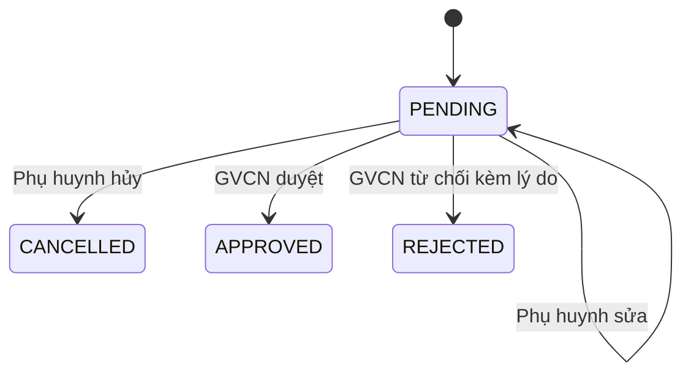

# Báo Cáo Nghiệp Vụ: Đơn Xin Nghỉ Học Cho Cha Mẹ (Phụ Huynh)

Dựa trên các tài liệu từ thư mục `docs-tham-khao`, dưới đây là báo cáo tổng hợp chi tiết về nghiệp vụ **Đơn xin nghỉ học** dành cho Phụ huynh và luồng xử lý liên quan.

## 1. Tổng Quan Nghiệp Vụ
Chức năng **Đơn nghỉ học** cho phép Phụ huynh tạo các yêu cầu xin nghỉ phép cho con em mình thông qua hệ thống (Parent App). Các đơn này sau đó sẽ được Giáo viên chủ nhiệm (GVCN) xem xét để duyệt hoặc từ chối.

> [!IMPORTANT]
> **Mục đích cốt lõi:** Đơn nghỉ học sau khi được duyệt (`APPROVED`) sẽ tự động làm căn cứ để hệ thống điểm danh đánh dấu trạng thái **"Vắng phép" (`EXCUSED_ABSENCE`)** cho học sinh trong các tiết học tương ứng.

## 2. Phân Loại Đơn Nghỉ Học
Có 2 loại đơn xin nghỉ:

*   **Đơn ngắn ngày (Một ngày):** Xin nghỉ trong phạm vi một ngày. Phụ huynh có thể xin nghỉ cả ngày hoặc **chọn từng tiết cụ thể**. Yêu cầu bắt buộc phải gửi kèm danh sách các tiết nghỉ (`lessonPeriodIds`).
*   **Đơn dài ngày:** Xin nghỉ theo một khoảng thời gian liên tục (từ ngày... đến ngày...). Đối với loại đơn này, phụ huynh không cần chọn tiết, hệ thống sẽ tự động xác định các tiết học bị ảnh hưởng trong khoảng thời gian đó.

*Lưu ý về dữ liệu:*
*   Hiện tại, đơn xin nghỉ **chỉ có trường lý do dạng text**.
*   **Không hỗ trợ đính kèm file (attachment)** trong MVP hiện tại theo quyết định chốt nghiệp vụ (dù trước đó có nêu trong tầm nhìn nhưng đã tinh giản để giữ cấu trúc đơn giản).

## 3. Quy Trình và Trạng Thái Đơn (State Machine)
Luồng thay đổi trạng thái của một đơn xin nghỉ được quy định như sau:

*   **Tạo mới:** Đơn mặc định ở trạng thái **`PENDING`** (Chờ duyệt).
*   **Sửa / Hủy:** Phụ huynh **chỉ được phép sửa hoặc hủy** đơn khi đơn vẫn đang ở trạng thái `PENDING`. Khi đã bị hủy (`CANCELLED`), duyệt (`APPROVED`) hoặc từ chối (`REJECTED`), phụ huynh không thể thao tác sửa hay hủy nữa.
*   **Từ chối:** Khi GVCN từ chối một đơn (`REJECTED`), **bắt buộc phải kèm theo lý do từ chối** (`rejection_reason`).

## 4. Phân Quyền (RBAC) & Ràng Buộc (Constraints)
*   **Phụ huynh (Parent App):**
    *   Quyền: Tạo, Xem, Sửa, Hủy đơn xin nghỉ của con.
    *   Ràng buộc: Chỉ thao tác được với học sinh mà phụ huynh đã được liên kết hợp lệ (active relationship).
*   **Giáo viên chủ nhiệm (GVCN):**
    *   Quyền: Xem danh sách đơn xin nghỉ của học sinh trong lớp mình chủ nhiệm, Duyệt hoặc Từ chối đơn.

## 5. Thiết Kế Cơ Sở Dữ Liệu
Dữ liệu đơn xin nghỉ được lưu trữ qua 3 bảng chính:

1.  **`leave_requests`**: Bảng chính lưu trữ thông tin đơn.
    *   Các trường quan trọng: `student_id`, `submitted_by_parent_id`, `request_type`, `start_date`, `end_date`, `reason`, `status`, `reviewed_by_teacher_id`, `rejection_reason`.
2.  **`leave_request_periods`**: Bảng lưu chi tiết các tiết học xin nghỉ.
    *   Chỉ bắt buộc áp dụng cho **đơn ngắn ngày** (chọn từng tiết).
    *   Với đơn dài ngày, không cần tạo record tiết trong bảng này.
3.  **`leave_request_history`**: Bảng append-only dùng để audit.
    *   Lưu lịch sử chuyển trạng thái của đơn: `from_status`, `to_status`, `reason`, `actor_account_id`.

## 6. Quy Ước API Endpoints
Các REST API phục vụ cho nghiệp vụ được thiết kế như sau:

**Phía Parent App (Dành cho Phụ huynh):**
*   `GET /students/{studentId}/leave-requests`: Xem danh sách đơn xin nghỉ của học sinh.
*   `POST /students/{studentId}/leave-requests`: Tạo đơn mới. Payload bao gồm: `startDate`, `endDate`, `lessonPeriodIds` (bắt buộc với đơn 1 ngày), và `reason`.
*   `PUT /students/{studentId}/leave-requests/{id}`: Sửa đơn (khi đang PENDING).
*   `DELETE /students/{studentId}/leave-requests/{id}`: Hủy đơn.

**Phía GVCN (Dành cho Giáo viên):**
*   `GET /leave-requests/pending`: Xem danh sách đơn đang chờ duyệt thuộc lớp chủ nhiệm.
*   `POST /leave-requests/{id}/approve`: Chấp thuận đơn xin nghỉ.
*   `POST /leave-requests/{id}/reject`: Từ chối đơn xin nghỉ (Yêu cầu phải có lý do).

---
*Báo cáo được tổng hợp dựa trên tài liệu: Quy trình nghiệp vụ, Quy ước API, và Data Dictionary của dự án.*
