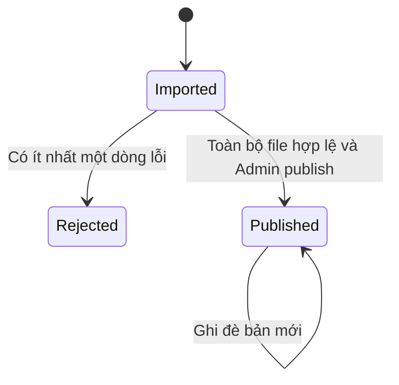
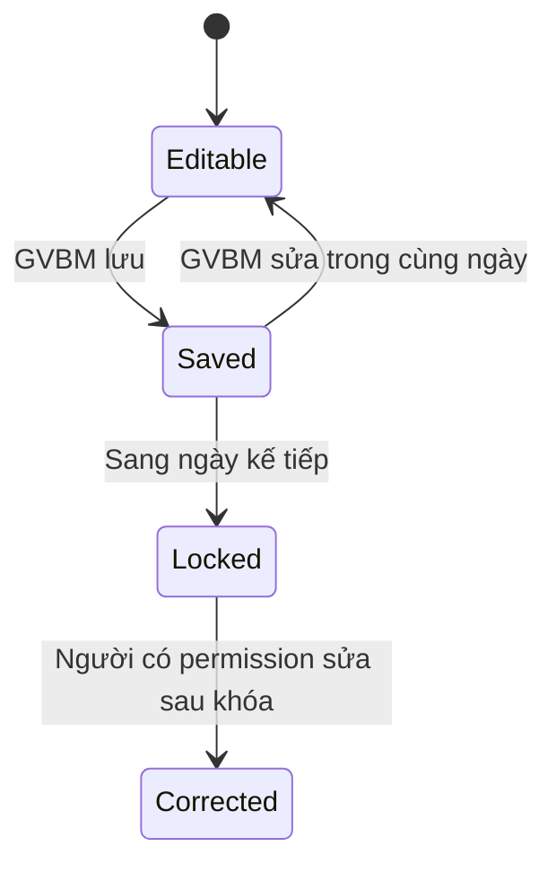
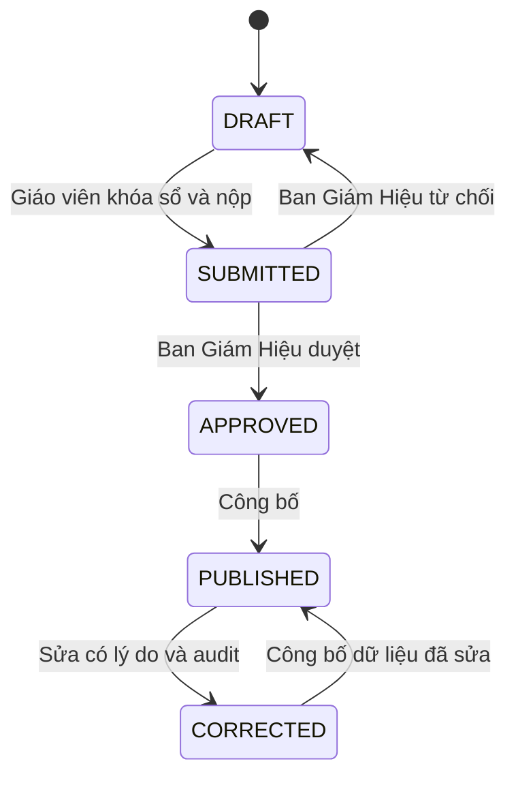
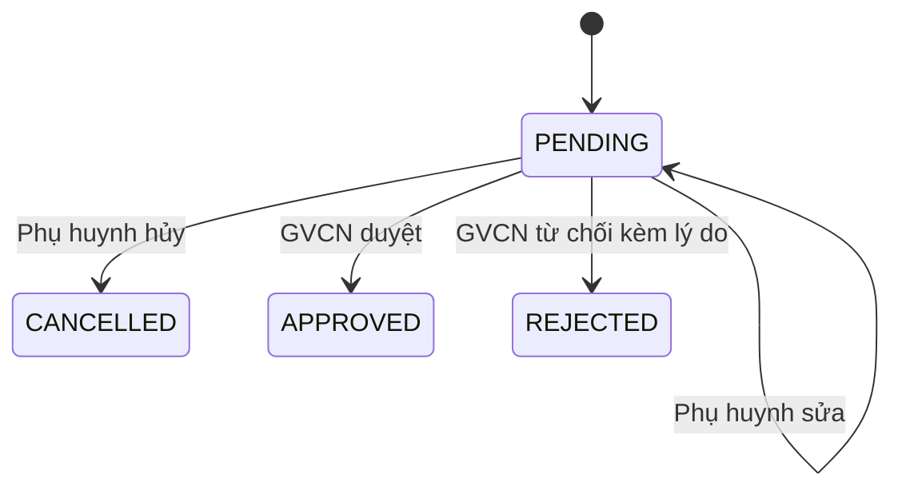

# Quy trình nghiệp vụ cốt lõi

**Trạng thái:** Accepted baseline

## Thời khóa biểu

- Import là một transaction atomic.
- File lỗi không ghi bất kỳ dòng nào; response trả lỗi theo số dòng/cột.
- Khi bản published bị ghi đè, gửi thông báo cho phụ huynh của lớp bị ảnh hưởng.
- MVP không lưu version nghiệp vụ đầy đủ, nhưng vẫn lưu thời gian/người publish gần nhất.

## Điểm danh

- Trạng thái: `PRESENT`, `EXCUSED_ABSENCE`, `UNEXCUSED_ABSENCE`, `LATE`.
- Push cho phụ huynh ngay khi giáo viên lưu, kèm giờ/tiết.
- Đơn nghỉ đã duyệt tự động làm căn cứ `EXCUSED_ABSENCE`.
- Ghi chú điểm danh được hiển thị cho phụ huynh.
- Sửa sau khóa phải lưu lịch sử và lý do.

## Sổ điểm và hạnh kiểm

- Điểm thường xuyên hệ số 1, giữa kỳ hệ số 2, cuối kỳ hệ số 3.
- Môn định tính dùng `PASS/FAIL`, không trộn với thang điểm số.
- Công thức, làm tròn và xếp loại là cấu hình có hiệu lực theo năm học.
- GVCN nhập hạnh kiểm cuối kỳ; Ban Giám Hiệu duyệt cùng đợt bảng điểm.
- Phụ huynh chỉ xem dữ liệu `PUBLISHED`.

## Đơn nghỉ học

- Đơn ngắn ngày: một ngày, cho phép chọn từng tiết.
- Đơn dài ngày: khoảng ngày liên tục.
- Chỉ có trường lý do dạng text, không có attachment.
- Sau `APPROVED`, phụ huynh không được sửa/hủy.

## Đăng ký CLB

- Mỗi học sinh có tối đa ba đăng ký đang hiệu lực.
- Đăng ký thành công ngay nếu còn slot; thao tác phải atomic để không vượt quota.
- Hết slot thì từ chối, không tạo waiting list.
- Không có thanh toán.
- Cho phép hủy; thời hạn hủy đang là câu hỏi mở `Q-05`.

## CMS và thông báo

- Dùng chung nội dung với type `NEWS`, `ANNOUNCEMENT`, `EVENT`.
- Trạng thái chỉ gồm `DRAFT`, `PUBLISHED`.
- Publish ngay, không scheduler.
- Target tối thiểu: toàn trường, khối hoặc lớp.
- Push là kênh báo hiệu; nội dung đồng thời được lưu trong trung tâm thông báo.
- Không yêu cầu xác nhận đã đọc, nhưng vẫn lưu trạng thái read/unread cho UX cá nhân.

