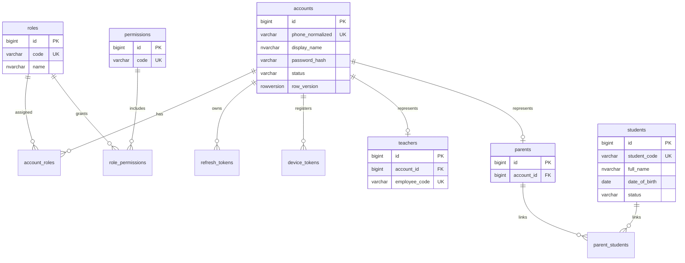
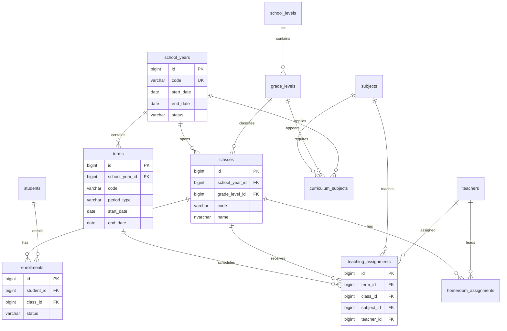
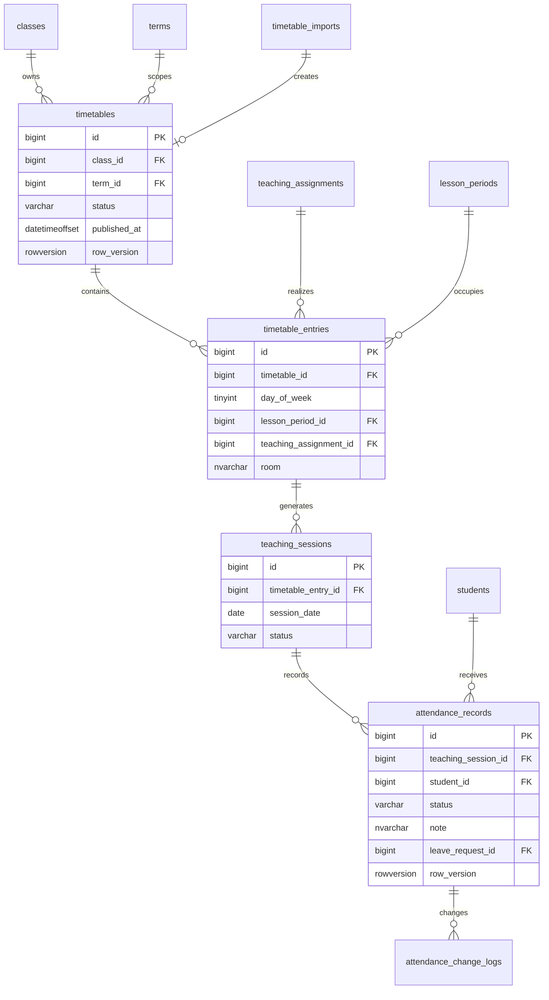
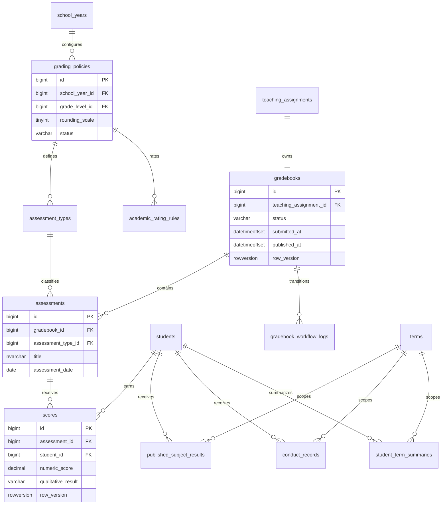
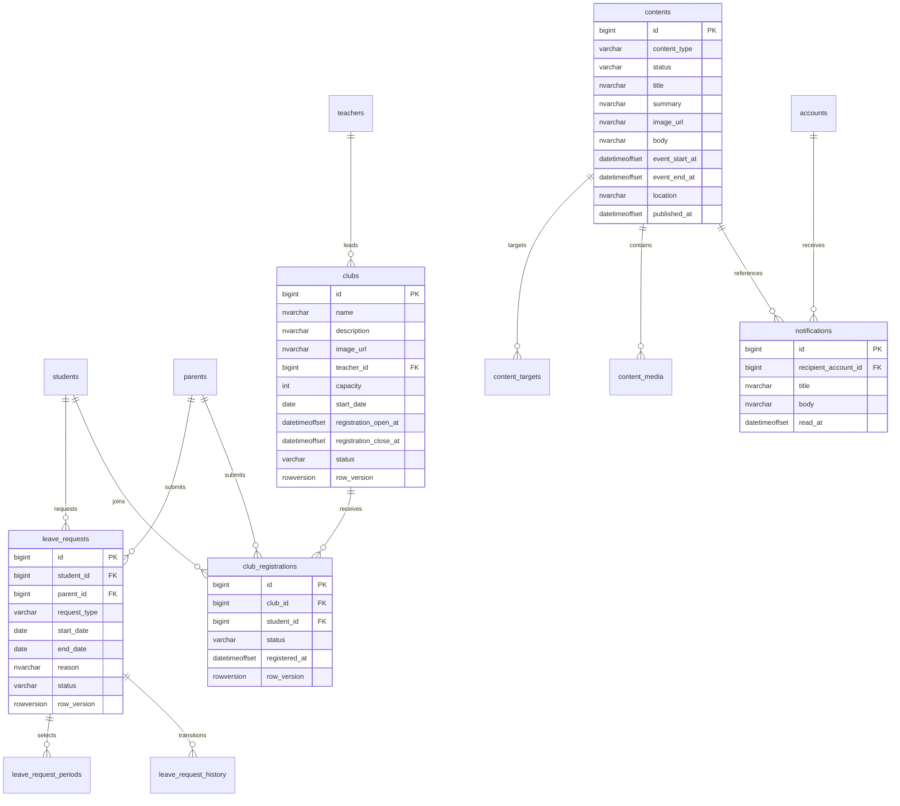

# ERD MyFPTSchool

**Trạng thái:** F01-F05 đã triển khai; F06-F08 là logical baseline
ERD được tách theo bounded context để dễ đọc. Quan hệ cross-context được mô tả bằng FK trong
[data dictionary](data-dictionary.md).

## Identity và con người

## Cấu trúc học vụ

## Thời khóa biểu và điểm danh

## Điểm và hạnh kiểm

## Đơn nghỉ, nội dung và CLB

