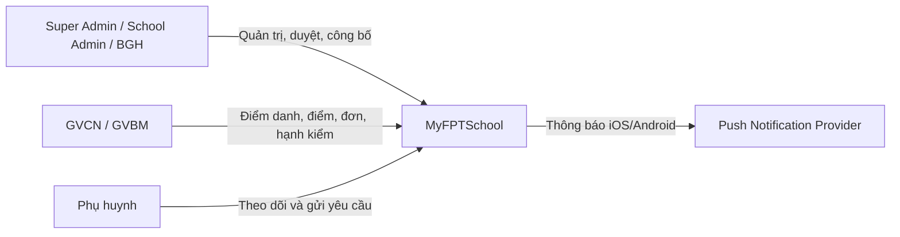
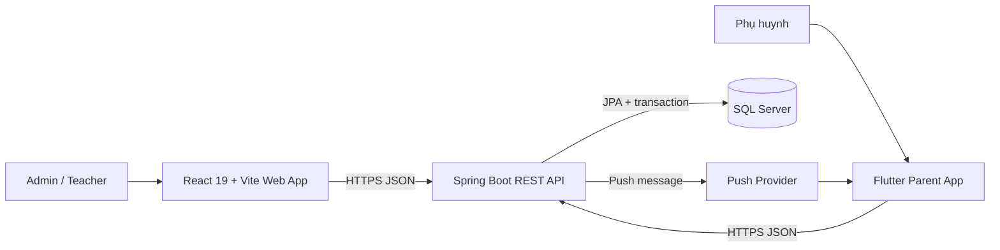

# Kiến trúc tổng quan

**Trạng thái:** Accepted baseline
**Cập nhật:** 2026-06-15

## Nguyên tắc

- Một backend modular monolith là nguồn sự thật cho cả ba portal.
- Một React web app phục vụ Admin Portal và Teacher Workspace bằng RBAC.
- Parent App là Flutter, chỉ dành cho phụ huynh.
- Backend kiểm tra permission và data scope; client không phải security boundary.
- Dùng transaction cho import atomic, slot CLB, publish và state transition.
- Chưa tách microservice ở quy mô một trường.

## C4 - System context



## C4 - Container



## Repository

```text
.
├── mysfchoolse1911webapp/   # React/Vite: Admin + Teacher
├── myfschoolse1911/         # Flutter: Parent App
├── myfschoolse1911backend/  # Spring Boot API
└── docs/
```

Cây thư mục, dependency rules, naming và vị trí test chi tiết xem
[Cấu trúc dự án](cau-truc-du-an.md).

## Web React

Đề xuất chuyển scaffold JavaScript sang TypeScript trước khi tạo nhiều feature.

```text
src/
├── app/             # router, providers, auth, permission guard
├── shared/          # UI kit, API client, error handling
└── features/
    ├── accounts/
    ├── academics/
    ├── timetable/
    ├── attendance/
    ├── gradebook/
    ├── leaveRequests/
    ├── content/
    └── clubs/
```

- Route guard phục vụ UX; API vẫn kiểm tra quyền.
- Permission check dùng permission string, không rải điều kiện role trong component.
- Server state và form state phải có ownership rõ; chọn thư viện qua ADR khi bắt đầu code.

## Mobile Flutter

MVC đơn giản theo namespace dự án:

```text
lib/vn/edu/fpt/
├── controller/
├── model/
├── view/
├── service/
├── repository/
├── util/
├── route/
├── theme/
├── config/
└── constant/
```

Luồng dependency: `View -> Controller -> Repository -> Service`. Business rule chính thức
vẫn nằm ở backend.

## Backend Spring Boot

```text
vn.edu.fpt.myfschool/
├── common/
├── security/
├── identity/
├── people/
├── academic/
├── timetable/
├── attendance/
├── assessment/
├── conduct/
├── leave/
├── content/
├── notification/
└── club/
```

Trong module: `api -> application -> domain <- infrastructure`.

- API: controller, DTO, validation.
- Application: use case, authorization orchestration, transaction.
- Domain: rule và state transition.
- Infrastructure: JPA, file parser, push adapter.

## Tính nhất quán và realtime

- Push được gửi sau khi transaction dữ liệu thành công.
- Production nên dùng outbox/retry để tránh dữ liệu đã lưu nhưng push bị mất.
- “Realtime” ở Parent App nghĩa là push ngay sau thao tác lưu, không yêu cầu WebSocket.
- Import TKB parse/validate toàn file trước, chỉ commit khi không có lỗi.
- Đăng ký CLB khóa/atomic update để không vượt slot khi nhiều request đồng thời.

## Bảo mật và dữ liệu

- Số điện thoại chuẩn hóa trước khi kiểm tra unique.
- Password hash bằng encoder mạnh; không lưu/gửi lại plaintext.
- Mọi endpoint theo học sinh kiểm tra quan hệ phụ huynh-học sinh.
- Mọi endpoint giáo viên kiểm tra phân công theo năm/lớp/môn/học kỳ.
- Dữ liệu sau khóa/công bố cần audit tối thiểu dù không có module audit UI.
- Migration database có version; không dùng auto-DDL production.

ERD và danh mục bảng chi tiết xem [Thiết kế cơ sở dữ liệu](database/README.md).
